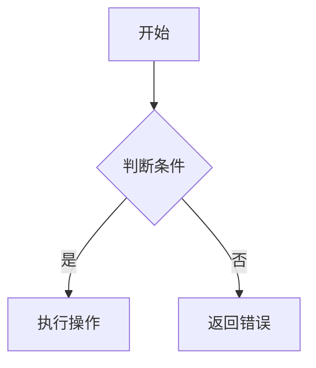

# {功能名称} 技术设计文档

## 1. 设计概要
- 目标：
- 技术路线：
- 涉及模块：
- 不涉及模块：

## 2. 现有实现对齐
### 2.1 参考实现
- 参考 Controller：
- 参考 Service：
- 参考 Mapper / XML：
- 参考 DTO / Entity / 常量：

### 2.2 复用与改造策略
- 直接复用：
- 局部扩展：
- 不采用的现有方案及原因：

## 3. 决策记录
- **备选方案**：
- **最终选择**：
- **权衡**：

## 4. 详细设计
### 4.1 业务流程
> 使用 Mermaid 语法描述核心业务流程、关键分支、异常或回滚节点。


### 4.2 模块与文件改动
- `iho-mrms-api`：
- `iho-mrms-provider`：
- `iho-mrms-rest`：
- `iho-mrms-sdk`：
- `doc/specs/{yyyyMMdd中文功能名}`：
- `doc/feat/feat_v*.md`：
- `*.sql`：

### 4.3 接口与契约设计
#### 4.3.1 Controller / API
- 路径：
- 方法：
- 入参：
- 出参：
- 权限/上下文要求：

#### 4.3.2 DTO / Service 接口
```java
public interface XxxService {
    // 说明核心方法签名
}
```

### 4.4 数据模型与数据访问
#### 4.4.1 表与字段影响
- 涉及表：
- 字段变更：
- 索引/约束：
- 是否需要 DDL / 数据修复脚本：

#### 4.4.2 Mapper 与 SQL 设计
- Mapper 接口：
- Mapper XML：
- 关键查询/更新语义：
- 分页、排序、过滤条件：

### 4.5 事务与集成设计
- 事务边界：
- 并发/幂等：
- 系统参数：
- 外部 SDK / REST：
- 事件 / 异步：
- 缓存：

## 5. 安全性、异常与可观测性
- 非法输入与参数校验：
- 业务异常与错误码：
- 日志与埋点：
- 回滚与补偿：

## 6. 兼容性与发布影响
- 兼容现有接口/流程的方式：
- 配置或参数初始化要求：
- 版本说明是否需要更新：
- 发布与回退注意事项：

## 7. 验证方案
- **自动化验证**：
- **模块编译验证**：
- **手工验证步骤**：
- **未覆盖风险**：
