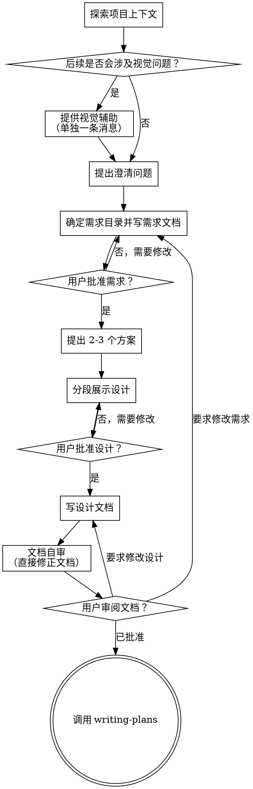

# 将想法梳理成需求与设计

通过自然、协作式的对话，把模糊想法逐步收敛成完整需求、设计和后续任务输入。

先理解当前项目上下文，再一次只问一个问题来逐步澄清需求。等你真正理解用户要做什么之后，先给出设计方案，拿到用户批准，再进入实现。

<HARD-GATE>
在你已经展示设计并获得用户批准之前，不要调用任何实现类 skill，不要写代码，不要搭脚手架，也不要采取任何实现动作。无论任务看起来多简单，这条规则都成立。
</HARD-GATE>

## 反模式：“这太简单了，不需要设计”

所有项目都要走这个流程。待办清单、小工具函数、配置改动，都一样。很多返工恰恰发生在“看起来很简单”的任务上，因为隐藏假设没有被显性化。设计可以很短，但不能省略。

## 清单

你必须为下面每一项创建任务，并按顺序完成：

1. **探索项目上下文**：检查代码、文档、近期提交
2. **提供视觉辅助选项**（如果后面会涉及视觉问题）
3. **提出澄清问题**：一次一个，弄清目的、约束、成功标准
4. **确定需求目录并写需求文档**：保存到 `doc/specs/<需求目录名>/requirements.md`
5. **提出 2-3 个方案**：包含取舍、并给出推荐
6. **展示设计**：按复杂度分段展示，并在每段后征求确认
7. **写设计文档**：保存到 `doc/specs/<需求目录名>/design.md`
8. **文档自审**：快速检查 `requirements.md` 与 `design.md` 的占位符、冲突、歧义、范围
9. **请用户审阅文档**：在继续前请用户查看 `requirements.md` 与 `design.md`
10. **切换到实现规划**：调用 `writing-plans` skill 生成 `tasks.md`

## 流程图

**终点只能是调用 `writing-plans`。**  
不要在 brainstorming 结束后直接跳去实现类 skill。

## 具体过程

### 理解想法

- 先看当前项目状态：文件、文档、近期提交
- 在提细节问题前先评估范围：如果用户一口气描述了多个彼此独立的子系统，应立即指出这一点
- 如果范围太大，先帮助用户拆成子项目：哪些部分独立、彼此关系是什么、顺序怎么排
- 每个子项目各自走一轮“requirements -> design -> tasks -> implementation”
- 在 requirements 阶段一旦确定 `需求目录名`，后续所有文档和流程都必须沿用这个目录，不能重新计算
- 对范围合适的任务，一次只问一个问题
- 能用多选题时优先多选题
- 重点是搞清：目的、约束、成功标准

### 探索方案

- 给出 2-3 个不同方案
- 每个方案都要说明取舍
- 先给推荐方案，并解释为什么推荐它

### 展示设计

- 当你认为自己已经理解要做什么时，再开始展示设计
- 每节内容应和复杂度匹配：简单问题几句话即可，复杂问题控制在 200-300 词左右
- 每讲完一节，都问用户“到这里是否正确”
- 通常应覆盖：架构、组件、数据流、错误处理、测试
- 如果用户指出某处不清楚，就回退澄清

### 为隔离性和清晰度而设计

- 把系统拆成边界清晰的小单元，每个单元只承担一个明确职责
- 单元之间通过清晰接口交互，便于单独理解和测试
- 对每个单元，你都应能回答：它做什么、怎么用、依赖什么
- 如果不看内部实现就理解不了它，那边界通常还不够好
- 小而聚焦的单元更容易被你稳定修改；文件过大通常说明职责过多

### 在现有代码库中工作

- 提方案前先看现有结构，尽量沿用既有模式
- 如果现有代码本身影响了本次工作，例如文件过大、职责混乱，可以把**与当前任务直接相关的改良**纳入设计
- 不要借题发挥做无关重构

## 设计之后

### 文档化

- 目录固定为项目根目录下的 `doc/specs/<需求目录名>/`
- 如果目录不存在，先自动创建目录，再写文档
- 将确认过的需求写入 `doc/specs/<需求目录名>/requirements.md`
- 将确认过的设计写入 `doc/specs/<需求目录名>/design.md`
- `需求目录名` 的格式固定为 `yyyyMMdd中文功能名`，例如 `20260407护理管理新增病例讨论`
- 其中 `yyyyMMdd` 是**首次创建需求文档当天**的日期，`中文功能名` 是需求描述的中文简要表达
- 一旦 `requirements.md` 已创建成功，`需求目录名` 就被视为已确定；之后修改 `design.md`、生成 `tasks.md`、评审、执行时都必须直接沿用该目录
- 后续流程如果需要定位目录，优先使用当前已知的 `requirements.md` 路径；如果当前上下文没有缓存路径，再从项目根目录 `doc/specs/` 下查找本次需求对应的 `requirements.md` 所在目录并沿用，不能擅自新建同义目录
- 如果可用，可配合 `elements-of-style:writing-clearly-and-concisely`
- 将需求文档与设计文档提交到 git

### 设计自审

写完 `requirements.md` 与 `design.md` 后，用“第一次看它”的视角做快速自查：

1. **占位符检查**：是否还有 `TBD`、`TODO`、未完成章节、含糊要求？
2. **一致性检查**：需求与设计是否互相冲突？架构是否与功能描述吻合？
3. **范围检查**：这组文档是否足够聚焦，能生成一份单独的 `tasks.md`？
4. **歧义检查**：是否存在两种都说得通的解释？如果有，选定一种并明确写出来

发现问题就直接在文档里修，不需要额外再走一轮评审。

### 用户审阅关口

自审通过后，必须请用户先看已写好的 `requirements.md` 与 `design.md`，再决定是否进入实现计划：

> “需求文档和设计文档已经写好，路径分别是 `<requirements-path>` 和 `<design-path>`。请先审阅一下，如果想修改，我们先把文档改到满意，再继续写 `tasks.md`。”

如果用户要求修改，就修改并再次跑自审。只有在用户明确认可后，才能继续。

### 切换到实现

- 接下来调用 `writing-plans`
- 不要调用其他 skill，下一步只能是 `writing-plans`

## 关键原则

- **一次只问一个问题**
- **优先多选题**
- **贯彻 YAGNI**
- **永远先给 2-3 个方案**
- **分段确认设计**
- **对不清楚的地方保持回退和澄清**

## 视觉辅助（Visual Companion）

这是一个基于浏览器的辅助方式，用于在 brainstorming 过程中展示草图、图示、比较方案等可视化内容。它只是工具，不是模式。用户同意使用后，表示它在需要时可被启用，不代表后续每个问题都必须走浏览器。

### 如何提出

如果你预判接下来的问题会明显依赖视觉表达，例如布局、界面、图示，应单独发一条消息征求同意：

> “我们接下来有些内容，如果能在浏览器里直接展示草图、图示或对比方案，会更容易沟通。我可以边讨论边做这些视觉内容。不过这个功能还比较新，token 消耗也会更高。要不要试一下？（需要打开本地 URL）”

**这条消息必须独立发送。**  
不要与澄清问题、上下文总结或其他内容混在一起。

如果用户拒绝，就继续用纯文本 brainstorming。

### 每个问题都单独判断

即使用户同意了，也要对每个问题单独判断是否真的需要浏览器。判断标准只有一个：

**用户看图会不会比看文字更容易理解？**

- **用浏览器：** 界面草图、布局对比、架构图、流程图、视觉风格选择
- **用终端：** 需求澄清、范围决策、方案取舍、技术讨论、A/B/C 文本选项

“与 UI 有关”不等于“必须可视化”。  
例如“这里的 personality 是什么意思？”是概念问题，应在终端讨论；  
“这两个向导布局哪个更合适？”是视觉问题，适合用浏览器。

如果用户接受视觉辅助，在继续前应阅读：

`skills/brainstorming/visual-companion.md`
