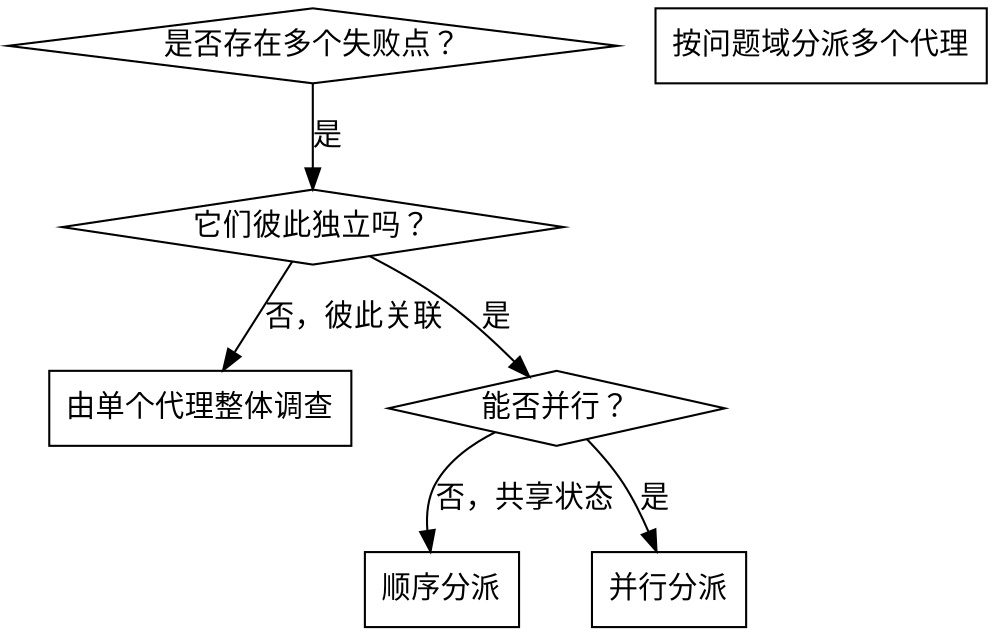

# 并行分派多个代理

## 概览

把任务分派给上下文隔离的专门代理。通过精确组织它们的说明与上下文，你可以让每个代理只处理自己那一小块问题，不继承你的整段会话历史。这样既能让它们更聚焦，也能保留你自己的上下文来做统筹。

当你面对多个互不相关的失败点时，按顺序逐个查通常是在浪费时间。既然每个问题可以独立调查，就应该并行推进。

**核心原则：**每个独立问题域派一个代理，并让它们并发工作。

## 何时使用



**适合使用：**

- 3 个以上测试文件失败，且根因明显不同
- 多个子系统各自坏掉，彼此独立
- 每个问题都能在不依赖其他问题上下文的情况下被理解
- 调查过程之间没有共享状态

**不适合使用：**

- 失败之间很可能互相关联，修一个会连带影响其他
- 必须整体理解系统状态
- 多个代理会彼此干扰

## 标准模式

### 1. 识别独立问题域

按“坏的是哪一类东西”来分组：

- A 文件：工具审批流程
- B 文件：批量完成行为
- C 文件：中止功能

如果这些问题之间彼此独立，就适合拆开处理。

### 2. 为每个代理写聚焦任务

每个代理都应拿到：

- **明确范围**：只负责一个测试文件或一个子系统
- **清晰目标**：让这组测试通过，或找出这一块根因
- **边界约束**：不要改其他无关代码
- **期望输出**：总结发现与修复内容

### 3. 并行分派

```typescript
Task("修复 agent-tool-abort.test.ts 的失败")
Task("修复 batch-completion-behavior.test.ts 的失败")
Task("修复 tool-approval-race-conditions.test.ts 的失败")
```

三者可并行执行。

### 4. 审核并集成

当各个代理返回后：

- 阅读每份总结
- 检查修复之间是否冲突
- 运行完整测试
- 统一集成各项变更

## 代理提示词结构

好的代理提示词应具备：

1. **聚焦**：只处理一个清晰的问题域
2. **自包含**：包含理解问题所需的全部上下文
3. **输出明确**：说明代理最终要返回什么

```markdown
修复 `src/agents/agent-tool-abort.test.ts` 中 3 个失败测试：

1. "should abort tool with partial output capture"：期望消息包含 'interrupted at'
2. "should handle mixed completed and aborted tools"：快速工具被错误中止
3. "should properly track pendingToolCount"：期望 3 个结果，实际得到 0 个

这些看起来是时序 / 竞态问题。你的任务：

1. 阅读测试文件，理解每个测试在验证什么
2. 找出根因：是时序问题，还是实现缺陷？
3. 修复时遵循：
   - 用事件或条件等待替换任意 timeout
   - 如果确实有中止逻辑缺陷，就修实现
   - 如果测试本身与真实行为不匹配，再调整测试期望

不要简单地把 timeout 调大。

返回：你发现了什么、你具体改了什么。
```

## 常见错误

**范围太大：**

- 错误：“把所有测试都修掉”
- 正确：“只修 `agent-tool-abort.test.ts`”

**缺少上下文：**

- 错误：“修一下竞态问题”
- 正确：提供报错、测试名、相关约束

**没有约束：**

- 错误：代理可能顺手大改一通
- 正确：明确“不要改生产代码”或“只修测试”

**输出模糊：**

- 错误：“修好它”
- 正确：“返回根因与修复摘要”

## 什么时候不要用

- 失败是关联的，应先整体调查
- 理解问题必须掌握系统全貌
- 还处在探索性调试阶段，问题边界都不清
- 多个代理会编辑同一批文件或共享同一资源

## 会话中的真实例子

**场景：** 一次大重构后，3 个测试文件里一共出现 6 个失败

**失败分布：**

- `agent-tool-abort.test.ts`：3 个失败（时序问题）
- `batch-completion-behavior.test.ts`：2 个失败（工具未执行）
- `tool-approval-race-conditions.test.ts`：1 个失败（执行次数为 0）

**判断：** 三块问题彼此独立，适合拆开

**分派：**

```text
代理 1 -> 修复 agent-tool-abort.test.ts
代理 2 -> 修复 batch-completion-behavior.test.ts
代理 3 -> 修复 tool-approval-race-conditions.test.ts
```

**结果：**

- 代理 1：把 timeout 改为基于事件的等待
- 代理 2：修正事件结构 bug（`threadId` 放错位置）
- 代理 3：补上等待异步工具执行完成

**集成：** 修复彼此独立、无冲突，完整测试通过

## 关键收益

1. **并行化**：多条调查同时发生
2. **聚焦**：每个代理只追踪一小块上下文
3. **隔离性**：互不干扰
4. **提速**：通常可以用接近 1 个问题的时间解决 3 个问题

## 验证

在代理返回后：

1. **读总结**：确认每个代理到底改了什么
2. **查冲突**：是否碰了同一块代码
3. **跑全量验证**：确认一起工作正常
4. **抽查结果**：代理也会犯系统性错误

## 实际效果

来自一次调试会话（2025-10-03）：

- 3 个文件里共 6 个失败
- 并行分派 3 个代理
- 各调查同时完成
- 修复顺利集成
- 零冲突
