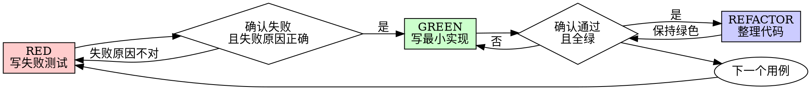

# 测试驱动开发（TDD）

## 概览

先写测试。看它失败。再写最小实现让它通过。

**核心原则：**如果你没有亲眼看到测试在修复前失败，你就不能确定这个测试真的测中了问题。

**违反规则的字面要求，也是在违反 TDD 的精神。**

## 何时使用

**默认始终使用：**

- 新功能
- 缺陷修复
- 重构
- 行为变更

**少数例外（必须先问用户）：**

- 一次性原型
- 纯生成代码
- 配置文件编辑

一旦脑子里出现“这次先跳过 TDD 吧”，那通常说明你在自我合理化。

## 铁律

```text
没有先失败的测试，就不要写生产代码
```

如果你在测试之前已经写了代码：

- 删掉
- 从头开始

**没有例外：**

- 不要把旧代码留作“参考”
- 不要一边看着旧代码一边写测试
- 不要说“我只是稍微改一改”
- “删掉”就是真的删掉

先从测试重新推导实现。

## 红-绿-重构



### 红：先写失败测试

写一个最小测试，描述你期望发生什么。

<Good>
```typescript
test('在前两次失败后第 3 次重试成功', async () => {
  let attempts = 0;
  const operation = () => {
    attempts++;
    if (attempts < 3) throw new Error('fail');
    return 'success';
  };

  const result = await retryOperation(operation);

  expect(result).toBe('success');
  expect(attempts).toBe(3);
});
```
命名清楚，测真实行为，只测一件事。
</Good>

<Bad>
```typescript
test('retry works', async () => {
  const mock = jest.fn()
    .mockRejectedValueOnce(new Error())
    .mockRejectedValueOnce(new Error())
    .mockResolvedValueOnce('success');
  await retryOperation(mock);
  expect(mock).toHaveBeenCalledTimes(3);
});
```
命名模糊，测的是 mock，而不是实际行为。
</Bad>

**要求：**

- 只测一个行为
- 名字明确
- 优先测真实代码，除非 mock 不可避免

### 验证 RED：亲眼看它失败

**强制要求，绝不能跳过。**

```bash
npm test path/to/test.test.ts
```

确认：

- 测试确实失败，而不是报环境错误
- 失败信息符合预期
- 它失败是因为功能还没实现，而不是拼写、导入、语法错误

**如果测试直接通过：**说明你没测到新行为，重写测试。

**如果测试报错而不是失败：**先修测试本身，直到它以正确方式失败。

### 绿：写最小实现

只写最少代码让当前测试通过。

<Good>
```typescript
async function retryOperation<T>(fn: () => Promise<T>): Promise<T> {
  for (let i = 0; i < 3; i++) {
    try {
      return await fn();
    } catch (e) {
      if (i === 2) throw e;
    }
  }
  throw new Error('unreachable');
}
```
刚好够用。
</Good>

<Bad>
```typescript
async function retryOperation<T>(
  fn: () => Promise<T>,
  options?: {
    maxRetries?: number;
    backoff?: 'linear' | 'exponential';
    onRetry?: (attempt: number) => void;
  }
): Promise<T> {
  // YAGNI
}
```
明显过度设计。
</Bad>

不要顺手加功能、顺手重构、顺手“优化”。

### 验证 GREEN：亲眼看它通过

**强制要求。**

```bash
npm test path/to/test.test.ts
```

确认：

- 当前测试通过
- 其他相关测试仍通过
- 输出干净，没有额外 error / warning

**如果测试失败：**修代码，不要随意改测试来迁就实现。

### 重构：通过后再整理

只有在绿色状态下才允许做这些事：

- 去重
- 改名
- 抽公共逻辑

整理后必须仍然保持测试全绿。

### 循环

当前行为确认后，再进入下一个失败测试。

## 什么是好测试

| 维度 | 好的做法 | 坏的做法 |
|------|----------|----------|
| 最小化 | 一次只测一件事 | 一个测试里塞多个行为 |
| 清晰度 | 名字直接描述行为 | `test('test1')` |
| 意图表达 | 看测试就知道 API 应该如何用 | 读完测试仍看不出需求 |

## 为什么顺序不能颠倒

### “我先写代码，之后再补测试验证就行”

代码写完后再写的测试，通常会立刻通过。而“立刻通过”不能证明任何事情：

- 你可能测错了对象
- 你可能只测了自己的实现细节
- 你可能漏掉了边界情况
- 你没有见过它捕获真实问题

测试先行会迫使你先看到失败，从而证明测试确实能抓到问题。

### “我已经手工把边界都试过了”

手工测试的问题是：

- 没有记录
- 改完代码后不能稳定重跑
- 压力大时很容易漏场景
- “我试的时候没问题”不等于系统性验证

自动化测试是可重复、可验证、可回归的。

### “已经写了很多代码，现在删掉很浪费”

这是典型的沉没成本谬误。时间已经花出去了，现在真正的选择是：

- 删掉并按 TDD 重写：再花一点时间，换来高置信度
- 硬留着代码补测试：表面省时间，但后面大概率靠调试还债

真正浪费的不是删掉旧代码，而是继续保留不可信的代码。

### “TDD 太教条了，务实一点就该灵活些”

TDD 本身就是最务实的做法：

- bug 在提交前暴露，成本最低
- 回归问题能第一时间被测试抓住
- 测试天然形成行为文档
- 重构时更安全

所谓“务实地跳过”，多数时候只是把成本转移到后面的调试和返工。

### “事后补测试能达到同样目标”

不能。事后测试回答的是“代码现在做了什么”，测试先行回答的是“代码应该做什么”。

事后测试会被你已经写出来的实现牵着走，只会验证你当前想到的情况；  
测试先行会迫使你在动手前想清楚边界和预期行为。

## 常见借口

| 借口 | 现实 |
|------|------|
| “太简单了，不值得测” | 简单代码也会坏，测试成本通常只要几十秒。 |
| “我先写完再测” | 事后通过的测试证明力很弱。 |
| “事后测效果一样” | 不一样。一个在验证实现，一个在定义行为。 |
| “我已经手测过了” | 手测不可重复，也不系统。 |
| “删掉几小时工作太亏了” | 沉没成本。保留不可信代码更亏。 |
| “先留着当参考” | 你一定会不自觉地照着它改。那还是事后测试。 |
| “我得先探索一下” | 可以探索，但探索代码最终也应丢弃，再按 TDD 正式实现。 |
| “测试写起来太痛苦” | 这往往说明设计本身就难用。 |
| “TDD 会拖慢速度” | 通常比后期调试更快。 |
| “手工测试更快” | 每次变更后都得重测，长期更慢。 |
| “现有代码本来就没测试” | 你是在改进它，不是在向坏现状看齐。 |

## 红旗：一旦出现就重来

- 测试之前已经写了代码
- 实现完成后才补测试
- 新测试第一次运行就通过
- 你说不清测试为什么失败
- 测试打算“之后再加”
- 出现“这次就例外”的想法
- 你说“我已经手工测过”
- 你说“事后测也一样”
- 你说“精神比仪式重要”
- 你说“先留作参考”
- 你说“已经花了太多时间，删掉太亏”
- 你说“TDD 太教条，我更务实”

**这些都意味着：删掉代码，按 TDD 重来。**

## 示例：修一个 bug

**问题：**空邮箱被错误接受

**RED**

```typescript
test('拒绝空邮箱', async () => {
  const result = await submitForm({ email: '' });
  expect(result.error).toBe('Email required');
});
```

**验证 RED**

```bash
$ npm test
FAIL: expected 'Email required', got undefined
```

**GREEN**

```typescript
function submitForm(data: FormData) {
  if (!data.email?.trim()) {
    return { error: 'Email required' };
  }
  // ...
}
```

**验证 GREEN**

```bash
$ npm test
PASS
```

**REFACTOR**

如果后续多个字段都要做类似校验，再在保持测试绿色的前提下抽公共验证逻辑。

## 完成前检查清单

- [ ] 每个新增函数 / 方法都有测试
- [ ] 每个测试都在实现前亲眼看过失败
- [ ] 每个测试失败的原因都正确
- [ ] 每次只写最小实现让测试通过
- [ ] 所有测试都通过
- [ ] 输出干净，没有额外报错和警告
- [ ] 测试尽量基于真实行为，而不是 mock 行为
- [ ] 错误场景和边界情况都有覆盖

有任何一项打不了勾，就说明你并没有真正执行 TDD。

## 卡住时怎么办

| 问题 | 处理方式 |
|------|----------|
| 不知道怎么测 | 先写你希望存在的 API，再写断言；必要时问用户。 |
| 测试太复杂 | 设计太复杂，先简化接口。 |
| 必须 mock 一切 | 代码耦合过高，考虑依赖注入。 |
| 测试搭建太大 | 抽测试辅助；如果仍然很复杂，重新审视设计。 |

## 与调试的关系

发现 bug 了？先写一个失败测试复现它，再走 TDD 循环。  
这样既能证明修复有效，也能防止回归。

**不要在没有测试的情况下修 bug。**

## 测试反模式

当你要引入 mock 或测试工具时，先阅读 `testing-anti-patterns.md`，避免以下问题：

- 测的是 mock，不是实际行为
- 为了测试去给生产代码加“测试专用方法”
- 对依赖关系没搞清楚就胡乱 mock

## 最终规则

```text
生产代码出现之前，必须已有一个先失败过的测试
否则就不叫 TDD
```

除非用户明确批准，否则没有例外。
