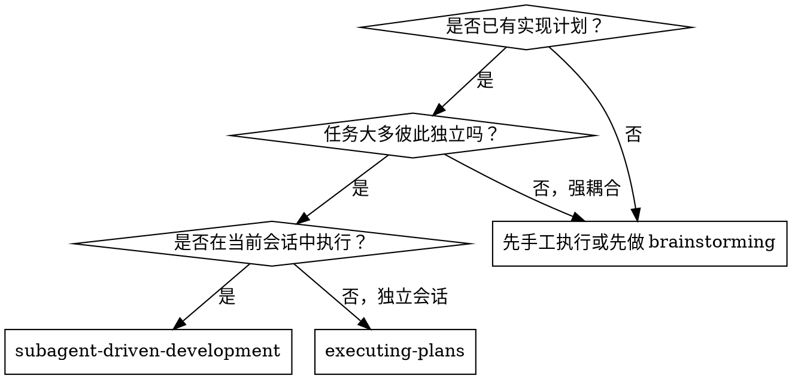
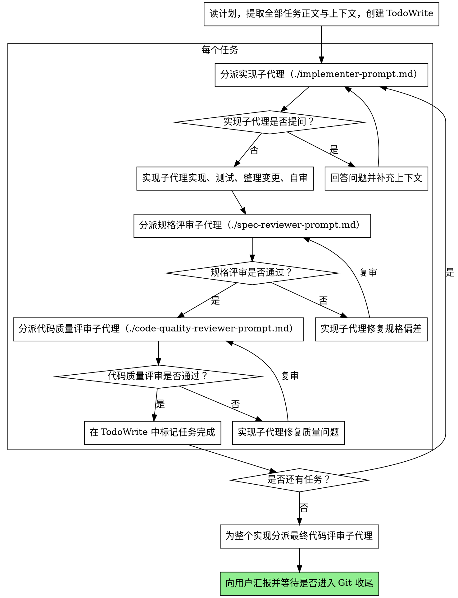

# 子代理驱动开发

通过“每个任务都派一个全新的子代理”来执行实现计划，并且在每个任务后强制执行两阶段评审：先检查是否符合 spec，再检查代码质量。

本流程默认以未提交变更推进：实现完成后先评审、先验证，不允许子代理或主代理因为“任务做完了”就直接 `git commit`。

**为什么要用子代理：**子代理上下文隔离。你把它真正需要的上下文精确打包给它，它就更容易专注完成任务，而不会被你的整段会话历史污染。与此同时，你自己的上下文也能保留下来，用于统筹、应答和决策。

**核心原则：**每个任务一个新子代理 + 两阶段评审（先规格一致性，再代码质量） = 高质量、快迭代。

## 何时使用



## 与 `executing-plans` 的区别

- 本 skill 在**当前会话**中完成
- 每个任务都用一个**全新**子代理
- 每个任务都执行**两阶段评审**
- 任务之间不需要人工手动接续，迭代更快

## 整体流程



## 模型选择

为了控制成本并提高速度，应为不同角色选择“刚好够用”的模型：

- **机械实现任务**：例如单函数、小范围、规格清晰、只动 1-2 个文件，使用更快更便宜的模型
- **集成与判断任务**：例如多文件协同、模式识别、调试，使用标准模型
- **架构、设计与评审任务**：使用能力最强的模型

### 复杂度信号

- 只涉及 1-2 个文件且 spec 完整 -> 便宜模型
- 涉及多个文件且有集成关注点 -> 标准模型
- 需要设计判断或广泛代码库理解 -> 最强模型

## 如何处理实现子代理的状态

实现子代理会返回以下 4 种状态之一：

### `DONE`

任务已完成，可以进入规格评审。

### `DONE_WITH_CONCERNS`

任务做完了，但实现者对某些点有顾虑。必须先读这些顾虑：

- 如果担心的是正确性、范围、实现偏差，应先处理，再进入评审
- 如果只是观察性问题，例如“文件开始变大了”，可记录后继续评审

### `NEEDS_CONTEXT`

说明你提供的信息不够。应补充缺失上下文后重新分派。

### `BLOCKED`

说明实现子代理无法完成任务。你应当判断原因：

1. 如果是上下文不够，补充信息后用同一模型重派
2. 如果是任务推理难度太高，换更强模型重派
3. 如果是任务太大，拆小
4. 如果是计划本身就有问题，升级给用户决策

**绝不要**忽视升级信号，也不要在什么都不变的情况下强迫同一模型重试。

## 提示词模板

- `./implementer-prompt.md`：实现子代理模板
- `./spec-reviewer-prompt.md`：规格一致性评审模板
- `./code-quality-reviewer-prompt.md`：代码质量评审模板

## 示例流程

```text
你：我正在使用 Subagent-Driven Development 执行这份计划。

[读取计划文件：doc/specs/<需求目录名>/tasks.md]
[提取全部 5 个任务的正文与上下文]
[创建 TodoWrite]

任务 1：安装 hook 脚本

[将任务 1 的正文与上下文打包给实现子代理]

实现子代理：开始前有个问题：这个 hook 应该装在用户级还是系统级？

你：用户级（`~/.config/superpowers/hooks/`）

实现子代理：收到，开始实现……
[稍后]
  - 已实现 install-hook 命令
  - 已补测试，5/5 通过
  - 自审时发现漏了 `--force`，已补上
  - 当前变更已整理，未提交

[分派规格评审]
规格评审：✅ 与 spec 一致，无遗漏也无额外功能

[分派代码质量评审]
代码评审：优点：测试充分，代码整洁。问题：无。批准。

[标记任务 1 完成]

任务 2：恢复模式

[分派实现子代理]
实现子代理：无问题，直接开始
  - 已新增 verify/repair 模式
  - 8/8 测试通过
  - 自审无异常
  - 当前变更已整理，未提交

[分派规格评审]
规格评审：❌ 发现问题：
  - 缺少进度汇报（spec 要求“每 100 项报告一次”）
  - 多做了 `--json` 参数（spec 没要求）

[实现子代理修复]
实现子代理：已删除 `--json`，已补进度汇报

[规格复审]
规格评审：✅ 现已一致

[分派代码质量评审]
代码评审：优点：实现扎实。问题（Important）：100 是魔法数字

[实现子代理修复]
实现子代理：已提取 `PROGRESS_INTERVAL` 常量

[代码质量复审]
代码评审：✅ 通过

[标记任务 2 完成]

……

[所有任务完成]
[分派最终 code-reviewer]
最终评审：所有要求已满足，可以向用户汇报结果，并等待是否执行 Git 收尾
```

## 优势

### 相比手工执行

- 子代理天然更容易遵循 TDD
- 每个任务都用新上下文，不容易混淆
- 更适合隔离性好的任务
- 子代理可以在开始前和过程中都提问

### 相比 `executing-plans`

- 不需要切会话
- 连续推进，等待更少
- 评审检查点更自动化

### 效率收益

- 控制器提前提取好任务正文，避免反复读文件
- 子代理一开始就拿到足够信息
- 场景和约束由控制器整理好，减少误解
- 问题更早暴露在开工前，而不是做完后

### 质量关口

- 实现者自审能先挡住一层问题
- 两阶段评审能分别控制“做对了”和“做好了”
- 复审循环保证问题真的被修掉
- 规格评审防止多做或少做
- 代码质量评审保证实现可维护

### 成本

- 每个任务至少会触发 1 个实现代理 + 2 个评审代理
- 控制器要提前做更多整理工作
- 复审循环会增加轮次
- 但这些成本往往比后期返工更便宜

## 红线

**绝不要：**

- 未经用户明确允许就在 `main` / `master` 上直接实现
- 跳过任何一层评审
- 带着未解决问题进入下一步
- 并行分派多个实现子代理去改同一批任务
- 让子代理自己去读计划文件（应直接把任务正文给它）
- 不做场景交代就让子代理开工
- 无视子代理的提问
- 在规格评审发现问题后仍然当作“差不多完成了”
- 跳过复审循环
- 用“实现子代理自审过了”替代真正评审
- 在规格评审通过前就进入代码质量评审
- 某个任务仍有开放问题时就切下一个任务
- 为了生成 SHA、合并或“保存进度”而直接 `git commit`
- 新需求已完成却没有补 `/doc/feat/feat_xxxx.md`

**如果子代理提问：**

- 要清晰、完整地回答
- 必要时补充更多上下文
- 不要催着它“先做了再说”

**如果评审发现问题：**

- 应由同一个实现子代理去修
- 修完后由对应评审再次复审
- 一直循环到通过

**如果子代理做失败：**

- 分派带明确指令的修复子代理
- 不要自己手动补几下就算了，避免污染上下文

## 集成关系

**必须配合的流程 skill：**

- **`superpowers:using-git-worktrees`**：开始前必须先建隔离工作区
- **`superpowers:writing-plans`**：生成将被执行的计划
- **`superpowers:requesting-code-review`**：提供代码评审模板
- **`superpowers:finishing-a-development-branch`**：用户明确要求执行 Git 动作时的收尾

**子代理自身应遵循：**

- **`superpowers:test-driven-development`**：每个任务都按 TDD 执行

**替代流程：**

- **`superpowers:executing-plans`**：如果不在当前会话中执行，则使用它
